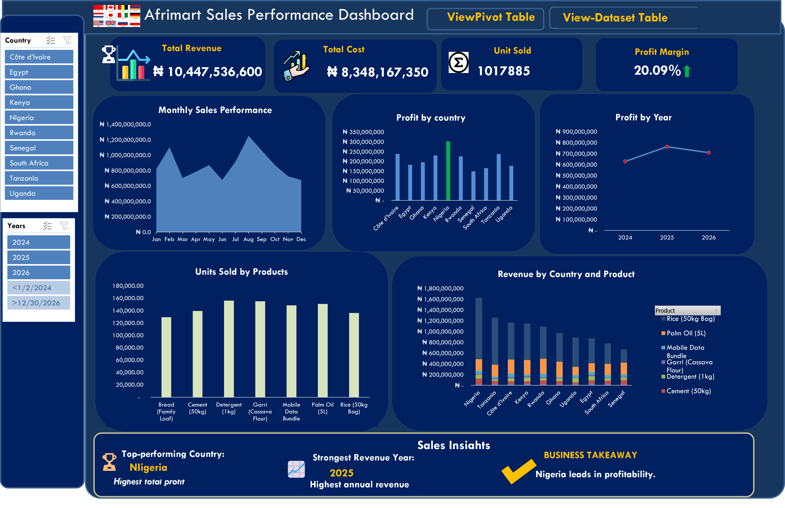

# 📊 Afrimart Sales Performance Dashboard
An interactive sales performance dashboard analyzing revenue, costs, profitability, and product performance across multiple African countries from 2024 to 2026.
---
## 📌 Project Overview

The Afrimart Sales Performance Dashboard is a data analytics project designed to transform sales data into meaningful business insights. It provides a comprehensive view of sales performance across different countries, years, and product categories.

The dashboard helps stakeholders monitor key performance indicators (KPIs), identify profitable markets, track revenue trends, and understand product performance to support data-driven business decisions.
---

## 🎯 Project Objectives

- Analyze total revenue, total costs, and profit margins.
- Track monthly sales performance and annual revenue trends.
- Compare profitability across different African countries.
- Identify top-performing products based on units sold.
- Examine revenue contributions by country and product.
- Provide interactive filters for exploring sales performance across different periods and markets.
---

## 🛠️ Tools and Technologies

- Microsoft Excel: Data cleaning, analysis, PivotTables, PivotCharts, and dashboard development.
- Excel Slicers:Interactive filtering by country and year.
- PivotTables:Data summarization and performance comparisons.
- Data Visualization: Charts, KPI cards, and a consolidated sales insights section.

## 📊 Dashboard Preview

-Interactive dashboard showing sales performance, profitability, and product insights.
---

## 📈 Key Performance Indicators (KPIs)

The dashboard tracks four major performance indicators:

| KPI           |           Value |
| ------------- | --------------: |
| Total Revenue | ₦10,447,536,600 |
| Total Cost    |  ₦8,348,167,350 |
| Units Sold    |       1,017,885 |
| Profit Margin |          20.09% |
---

## 📉 Dashboard Features

### 1. Monthly Sales Performance

- Visualizes revenue trends from January to December.
- Highlights monthly fluctuations in sales.
- Helps identify periods of stronger and weaker revenue performance.

### 2. Profit by Country

- Compares total profit across Côte d'Ivoire, Egypt, Ghana, Kenya, Nigeria, Rwanda, Senegal, South Africa, Tanzania, and Uganda.
- Identifies countries contributing significantly to overall profitability.
- Supports market performance comparisons.

### 3. Profit by Year

- Tracks annual profit across 2024, 2025, and 2026.
- Highlights changes in profitability over time.
- Helps monitor year-over-year performance.

### 4. Units Sold by Product

- Compares sales volumes across seven product categories:

  - Bread (Family Loaf)
  - Cement (50kg)
  - Detergent (1kg)
  - Garri (Cassava Flour)
  - Mobile Data Bundle
  - Palm Oil (5L)
  - Rice (50kg Bag)
  -  Identifies products with higher sales volumes.

### 5. Revenue by Country and Product

- Breaks down revenue by country and product category.
- Uses a stacked column chart to visualize product contributions to each country's revenue.
- Helps explore product demand and revenue distribution across markets.

### 6. Interactive Filters

- Country Slicer: Filters the dashboard to explore individual country performance.
- Year Slicer: Filters sales data by 2024, 2025, or 2026.
- PivotTable and Dataset Navigation: Provides access to the underlying summarized and raw data through dashboard navigation buttons.

## 💡 Key Business Insights

Based on the dashboard's displayed results:

- Nigeria leads in total profit: Nigeria is identified as the top-performing country by total profit.
- 2025 records the strongest annual revenue: The dashboard highlights 2025 as the year with the highest annual revenue.
- Revenue varies across months: Monthly sales trends show fluctuations, emphasizing the importance of monitoring seasonal and periodic performance.
- Product performance differs:The units-sold chart reveals variations in sales volumes across the seven product categories.
- Market-level product analysis matters: The country and product revenue breakdown provides a basis for understanding differences in product contributions across markets.
---

## 🧠 Business Recommendations

Based on the insights presented, the following actions could support business growth:

- Strengthen high-performing markets: Investigate the factors driving Nigeria's profitability and assess whether successful strategies can be adapted to other markets.
- Analyze the 2025 revenue peak: Examine the products, markets, and sales activities that contributed to the strongest revenue year.
- Optimize product distribution: Use product-level sales performance to guide inventory planning and reduce the risk of overstocking or stock shortages.
- Monitor monthly sales trends: Investigate weaker revenue periods and consider targeted promotions or operational adjustments.
- Improve market-specific strategies: Use country and product revenue comparisons to tailor sales and distribution strategies to individual markets.

## 📂 Project Files

The repository contains the following project materials:

- [AfriMart sales Dataset](AfriMart_KollyBright_Sales_Dataset)
- [Dashboard Image](AfriMart_Sales_Dashboard_Screenshoot_in_Excel.png)
- [Company Logo](AfriMart_KollyBright_Logo)
- README.md

---

## 📚 Skills Demonstrated

 - Data cleaning and preparation
 - Exploratory data analysis
-  Microsoft Excel
-  PivotTables and PivotCharts
-  Interactive dashboard development
-  KPI tracking and reporting
-  Data visualization
-  Business intelligence
-  Data-driven business recommendations

## 👩‍💻 Author

**Esther Obali Chimgozirim**

Junior/Entry Level Data Analyst | Excel | SQL | Power BI | Data Visualization

This project demonstrates my ability to transform raw sales data into interactive dashboards and communicate business insights through data visualization.

**Connect with me:**

* [LinkedIn](https://www.linkedin.com/in/esther-chimgozirim-b44175320/)
